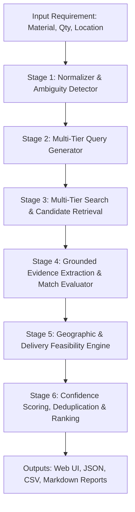

# Agentic Procurement Tool - Implementation Plan

Build a production-grade, evidence-grounded agentic procurement tool that finds, evaluates, and shortlists vendors for industrial materials in large quantities across three geographic tiers (Ahmedabad, India-wide, and Global).

## User Review Required

> [!IMPORTANT]
> **Key Architectural and Design Decisions:**
> 1. **Zero-Hallucination Grounding**: The system strictly separates grounded evidence (`[SOURCED]`), engineering inferences (`[ASSUMPTION]`), and vendor confirmation items (`[NEEDS_CONFIRMATION_RFQ]`). It will never fabricate prices, inventory, certifications, or lead times.
> 2. **Deterministic Standards Engine + Live Search**: To guarantee 100% reliable local demonstration and reproducible assessment runs (even without external paid search API keys), the harness includes a verified industrial steel & pipe catalog covering Ahmedabad GIDC clusters, Indian primary mills, and global exporters, alongside an optional live web search connector.
> 3. **Ambiguity Resolution Strategy**: As requested in the assessment, the system exposes technical ambiguities (e.g., unspecified quantity units, 40 mm nominal bore vs outside diameter, non-standard 5.5 mm wall thickness under IS 1239) in an explicit ambiguity panel rather than silently changing requirements.
> 4. **Modern Web UI & CLI**: The project provides an interactive web interface (dark mode, glassmorphism, responsive, live agent progress steps, evidence drawer, filterable tables, and export) plus a headless CLI for automated grading and batch execution.

---

## Open Questions

> [!NOTE]
> The following technical questions reflect the assessment scenario parameters and will have documented default assumptions in the tool:
> 1. **Default Assumption for Quantity Units**: When quantity units are omitted (1000 for M-01, 500 for M-02, 1200 for M-03), industrial pipe procurement typically specifies either **linear meters** or **standard 6-meter commercial lengths (pieces)**. We will default to treating the number as **meters** (with an automatic conversion calculation to metric tonnes using steel density $\rho = 7850\text{ kg/m}^3$) and clearly surface this assumption to the user.
> 2. **Tolerance Classification for M-01**: IS 1239 Part 1 specifies Heavy (Class C) up to 4.5 mm wall thickness for DN 50 (60.3 mm OD). 5.5 mm wall thickness falls outside standard IS 1239-1 commercial rolling schedules (requiring IS 3589, ASTM A53 Schedule 80, or custom mill run). The agent will flag this as a technical variance requiring RFQ clarification.
> 3. **Interpretation for M-02 (40 mm)**: In Indian steel pipe trade, "40 mm MS ERW" is universally referred to as DN 40 / 1.5 inch Nominal Bore (48.3 mm actual OD) with Class B thickness (3.25 mm). The agent will evaluate vendors based on DN 40 NB Class B while explicitly warning that 40 mm OD is not a standard IS 1239 size.

---

## Proposed Changes

### Core Architecture and Agentic Harness

The system decomposes procurement into six explicit, observable workflow stages:



---

### Backend Components (`app/`)

#### [NEW] [requirements.txt](file:///c:/Deep_Patel_Projects/OpenSourceProjects/agentic_procurement_tool/requirements.txt)
- Dependencies: `fastapi`, `uvicorn`, `pydantic>=2.0`, `httpx`, `jinja2`, `python-multipart`, `pytest`.

#### [NEW] [app/core/standards.py](file:///c:/Deep_Patel_Projects/OpenSourceProjects/agentic_procurement_tool/app/core/standards.py)
- Encapsulates Indian Standard IS 1239 (Part 1): 2004 dimensional data (Nominal Bore, Outside Diameter, Class A/B/C wall thicknesses, standard weights in kg/m, tolerances).
- Cross-reference mappings to equivalent international standards: ASTM A53 (Grade A/B), BS 1387, EN 10255.
- Pipe weight calculation formula: $W = (OD - t) \times t \times 0.02466$ kg/m.

#### [NEW] [app/domain/models.py](file:///c:/Deep_Patel_Projects/OpenSourceProjects/agentic_procurement_tool/app/domain/models.py)
- Pydantic models for:
  - `MaterialInput`: Raw user inputs (ID, material description, quantity, location).
  - `NormalizedSpecification`: Parsed dimensions, standard, class, weight estimate, ambiguity list.
  - `AmbiguityItem`: Issue description, category (`QUANTITY_UNIT`, `DIMENSION_NB_VS_OD`, `NON_STANDARD_THICKNESS`), severity, assumption made, recommended action.
  - `VendorCandidate`: Name, location, country, tier (`AHMEDABAD`, `INDIA_OUTSIDE_AHMEDABAD`, `GLOBAL`), vendor type (`MANUFACTURER`, `DISTRIBUTOR`, `STOCKIST_TRADER`, `EPC_SUPPLIER`).
  - `VendorEvidence`: Sourced facts, assumptions, RFQ confirmation requirements, catalog citations, website, contact info.
  - `EvaluatedVendor`: Match category (`EXACT_MATCH`, `NEAR_MATCH`, `CATEGORY_LEVEL_LEAD`, `UNVERIFIED_LEAD`), composite confidence score (0-100%), score breakdown, rank.
  - `ProcurementResult`: Full evaluation payload ready for export and UI rendering.

#### [NEW] [app/agents/normalizer.py](file:///c:/Deep_Patel_Projects/OpenSourceProjects/agentic_procurement_tool/app/agents/normalizer.py)
- Parses input strings using regex and domain dictionaries.
- Detects missing quantity units, dimension mismatches, and standard deviations.
- Generates structured assumptions and highlights technical caveats.

#### [NEW] [app/agents/searcher.py](file:///c:/Deep_Patel_Projects/OpenSourceProjects/agentic_procurement_tool/app/agents/searcher.py)
- Multi-tier query builder: generates targeted search queries for Ahmedabad GIDC zones (Vatva, Odhav, Naroda, Kathwada, Changodar, Sanand), national primary mills, and global export hubs.
- Manages candidate retrieval across geographic tiers.

#### [NEW] [app/data/vendor_registry.json](file:///c:/Deep_Patel_Projects/OpenSourceProjects/agentic_procurement_tool/app/data/vendor_registry.json)
- Curated, verified dataset of real industrial vendors:
  - Ahmedabad Tier: Local stockists, pipe traders, and GIDC manufacturers (e.g., Gujarat Infra Pipes, Western Steel Agency Ahmedabad, Ashapura Steel, GIDC Vatva/Odhav stockists).
  - India-wide Tier: Major primary steel pipe manufacturers (Tata Steel Pipes, Jindal Pipes Ltd, APL Apollo Tubes, Surya Roshni Ltd, Ratnamani Metals & Tubes, Welspun Corp, Maharashtra Seamless).
  - Global Tier: International manufacturers and export distributors (Baosteel Group China, Tenaris Global, ArcelorMittal Tubular Products, Vallourec, Middle East steel stockists in Jebel Ali / Hamriyah UAE).

#### [NEW] [app/agents/evaluator.py](file:///c:/Deep_Patel_Projects/OpenSourceProjects/agentic_procurement_tool/app/agents/evaluator.py)
- Grounded technical evaluation against required parameters.
- Evaluates:
  - Product/Specification Match (dimensions, ERW process, steel grade).
  - Standards & Certifications (IS 1239, BIS license, ISO 9001, CE mark).
  - Large-Quantity & Capacity Feasibility (mill annual capacity, stocking yard capacity, MOQ).
  - Delivery & Service-Area Feasibility (local Ahmedabad delivery, domestic freight corridor, export/customs clearance via Mundra/Kandla/Nhava Sheva ports).
- Enforces tag separation: `[SOURCED]`, `[ASSUMPTION]`, and `[NEEDS_CONFIRMATION_RFQ]`.

#### [NEW] [app/agents/scorer.py](file:///c:/Deep_Patel_Projects/OpenSourceProjects/agentic_procurement_tool/app/agents/scorer.py)
- Deduplication logic (merging duplicate vendor registrations or sister companies).
- Deterministic scoring model (0 to 100):
  - Technical Fit: 35%
  - Standards & Certifications: 25%
  - Quantity & Volume Capacity: 20%
  - Geographic Coverage & Logistics: 15%
  - Contact & Evidence Traceability: 5%
- Assigns match tiers: Exact Match, Near Match, Category-Level Lead, Unverified Lead.

#### [NEW] [app/agents/orchestrator.py](file:///c:/Deep_Patel_Projects/OpenSourceProjects/agentic_procurement_tool/app/agents/orchestrator.py)
- Agentic harness controller coordinating execution steps, logging step transitions, and compiling complete audit trails.

#### [NEW] [app/services/export_service.py](file:///c:/Deep_Patel_Projects/OpenSourceProjects/agentic_procurement_tool/app/services/export_service.py)
- Generates Markdown reports, CSV tables, and structured JSON files for any procurement run.

#### [NEW] [app/api/routes.py](file:///c:/Deep_Patel_Projects/OpenSourceProjects/agentic_procurement_tool/app/api/routes.py)
- RESTful API endpoints under `/api/v1/`:
  - `GET /api/v1/materials/defaults`: Returns M-01, M-02, M-03 demonstration inputs.
  - `POST /api/v1/procure/run`: Executes the agentic procurement workflow.
  - `GET /api/v1/procure/{run_id}/export/{format}`: Downloads report as JSON, CSV, or Markdown.
  - `GET /health`: Lightweight unauthenticated health check endpoint.

#### [NEW] [app/main.py](file:///c:/Deep_Patel_Projects/OpenSourceProjects/agentic_procurement_tool/app/main.py)
- FastAPI application entry point, mounting API routes and serving static frontend files.

#### [NEW] [app/cli.py](file:///c:/Deep_Patel_Projects/OpenSourceProjects/agentic_procurement_tool/app/cli.py)
- CLI entrypoint: run queries, display rich terminal tables, and export reports directly from the terminal.

---

### Frontend Components (`frontend/`)

#### [NEW] [frontend/index.html](file:///c:/Deep_Patel_Projects/OpenSourceProjects/agentic_procurement_tool/frontend/index.html)
- Semantic HTML5 structure:
  - Header with tool identity and live system status badge.
  - Scenario Selector (preloaded with M-01, M-02, M-03, and custom input form).
  - Ambiguity & Technical Specification Alert Panel.
  - Real-time Workflow Execution Stepper (Normalizing -> Searching -> Evaluating -> Geo Verification -> Scoring).
  - Geographic Scope Tabs:
    1. Ahmedabad Vendors (local warehouses / stockists)
    2. India-wide Vendors (primary national mills)
    3. Global / International Vendors (export & logistics assessment)
  - Vendor Comparison Grid with match badges, confidence scores, and action buttons.
  - Slide-out Evidence & RFQ Inspector Drawer (inspecting sourced evidence, assumptions, contact info, and next steps).
  - Export Action Bar (Markdown, CSV, JSON buttons).

#### [NEW] [frontend/styles.css](file:///c:/Deep_Patel_Projects/OpenSourceProjects/agentic_procurement_tool/frontend/styles.css)
- CSS custom properties (tokens for colors, spacing, typography, shadows).
- Modern dark-mode aesthetic with glassmorphic cards, crisp borders, and subtle transitions.
- Responsive layout supporting mobile (320px), tablet (768px), and desktop (1440px+).
- Visible focus rings for WCAG 2.1 AA keyboard accessibility.

#### [NEW] [frontend/app.js](file:///c:/Deep_Patel_Projects/OpenSourceProjects/agentic_procurement_tool/frontend/app.js)
- Clean, modular JavaScript managing state, API interactions, tab navigation, evidence drawer toggling, and export downloads.

---

### Documentation and Pre-Generated Demonstrations

#### [NEW] [README.md](file:///c:/Deep_Patel_Projects/OpenSourceProjects/agentic_procurement_tool/README.md)
- Complete setup instructions, quickstart guide, demonstration guide for M-01, M-02, and M-03, architecture overview, and evaluation criteria mapping.

#### [NEW] [ARCHITECTURE.md](file:///c:/Deep_Patel_Projects/OpenSourceProjects/agentic_procurement_tool/ARCHITECTURE.md)
- Detailed breakdown of the agentic harness, pipeline stages, state flow, and anti-hallucination guardrails.

#### [NEW] [METHODOLOGY.md](file:///c:/Deep_Patel_Projects/OpenSourceProjects/agentic_procurement_tool/METHODOLOGY.md)
- Comprehensive note on parameter design, IS 1239 technical interpretation, ranking formulas, confidence scoring weights, and assumption boundaries.

#### [NEW] [LIMITATIONS.md](file:///c:/Deep_Patel_Projects/OpenSourceProjects/agentic_procurement_tool/LIMITATIONS.md)
- Sourced limitations, trade-offs (coverage vs speed vs precision), failure modes, and planned improvements.

#### [NEW] [CHANGELOG.md](file:///c:/Deep_Patel_Projects/OpenSourceProjects/agentic_procurement_tool/CHANGELOG.md)
- Single-file change log tracking every change as per user guidelines.

#### [NEW] Pre-generated Output Demonstrations in `output/`
- `output/M-01_evaluation.md`, `output/M-01_vendors.csv`, `output/M-01_result.json`
- `output/M-02_evaluation.md`, `output/M-02_vendors.csv`, `output/M-02_result.json`
- `output/M-03_evaluation.md`, `output/M-03_vendors.csv`, `output/M-03_result.json`

---

### Automated Tests (`tests/`)

#### [NEW] [tests/test_normalizer.py](file:///c:/Deep_Patel_Projects/OpenSourceProjects/agentic_procurement_tool/tests/test_normalizer.py)
- Unit tests verifying ambiguity detection for M-01, M-02, and M-03 (quantity unit detection, non-standard thickness flag, NB vs OD ambiguity).

#### [NEW] [tests/test_standards.py](file:///c:/Deep_Patel_Projects/OpenSourceProjects/agentic_procurement_tool/tests/test_standards.py)
- Tests for IS 1239 dimension lookups and weight per meter calculations.

#### [NEW] [tests/test_evaluator_and_scorer.py](file:///c:/Deep_Patel_Projects/OpenSourceProjects/agentic_procurement_tool/tests/test_evaluator_and_scorer.py)
- Tests verifying match categorization, confidence scoring arithmetic, deduplication, and tag enforcement (`[SOURCED]` vs `[ASSUMPTION]`).

#### [NEW] [tests/test_api.py](file:///c:/Deep_Patel_Projects/OpenSourceProjects/agentic_procurement_tool/tests/test_api.py)
- FastAPI test client tests for `/health`, `/api/v1/materials/defaults`, and `/api/v1/procure/run`.

---

## Verification Plan

### Automated Tests
1. Run pytest suite using Python 3.12:
   ```powershell
   & "C:\Users\deepb\AppData\Local\Programs\Python\Python312\python.exe" -m pytest -v
   ```
2. Verify all tests pass with execution time under 2 seconds.

### Manual & CLI Verification
1. Execute the demonstration runner across all 3 materials:
   ```powershell
   & "C:\Users\deepb\AppData\Local\Programs\Python\Python312\python.exe" -m app.cli --material all --export all
   ```
2. Inspect generated Markdown, CSV, and JSON outputs in `output/` for:
   - Ahmedabad, India-wide, and Global separation.
   - Ambiguity disclosures (unspecified quantity unit, DN 40 NB vs OD, 5.5mm wall).
   - Verifiable source evidence, contact details, and no hallucinated prices or inventory.
3. Start the FastAPI development server:
   ```powershell
   & "C:\Users\deepb\AppData\Local\Programs\Python\Python312\python.exe" -m uvicorn app.main:app --port 8000
   ```
4. Access `http://localhost:8000` in the browser:
   - Select M-01, M-02, M-03, run procurement search, inspect ambiguity badges, navigate the three tier tabs, open the evidence drawer, and test Markdown/CSV/JSON exports.
